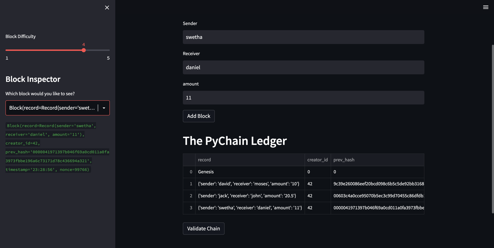
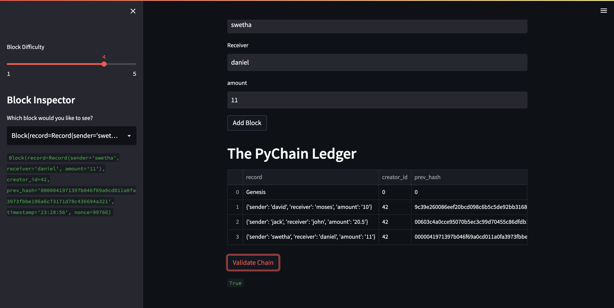

# pychain ledger - Blockchain app Using Python and Streamlit

This app is a simple implementation of a blockcahin using the sha256 hashing algorithm.

## Execution instructions:
In the terminal, run the Streamlit application by typying
 ```streamlit run pychain.py``` 

## Screenshots of the app

### Blockchain example:


## Blockchain validity check:
